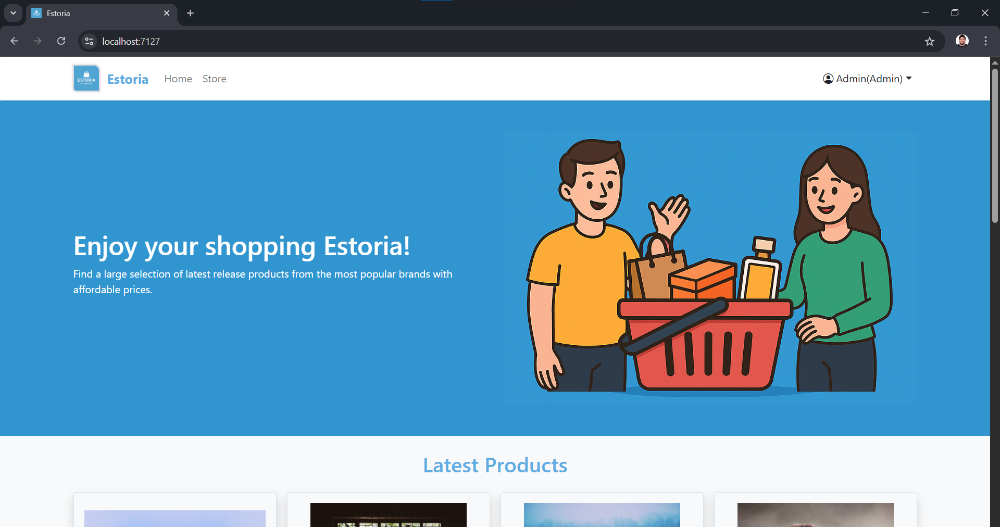

# 🛍️ EstoriaEcommerce (ASP.NET MVC)

**EstoriaEcommerce** is a full-featured e-commerce web application built with ASP.NET MVC. It includes admin management tools, a product store for users, and user authentication. The project is currently in development.

---

## 🚀 Live Demo

Not deployed yet — screenshots available below. Live version coming soon.

---

## 🧩 Features

### 🔧 Admin Panel
- Full CRUD operations for managing products
- Filtering by product name/category
- Search functionality
- Pagination for large data sets

### 🛒 Storefront
- Home page displays the latest products
- Store page shows products in responsive cards
- Filtering by category
- Sorting by price/name/date
- Product search box

### 🔐 Authentication
- User registration
- User login with validation

---

## 📸 Screenshots

> *(Save your images in a `screenshots/` folder and push them to GitHub)*

### Admin CRUD


### Store Page


### Login / Register


### Home Page


---

## 🛠️ Tech Stack

- **Backend:** ASP.NET MVC 5, C#
- **ORM:** Entity Framework
- **Database:** SQL Server
- **Frontend:** Bootstrap, Razor Views, HTML/CSS
- **Authentication:** ASP.NET Identity

---

## ⚙️ Project Setup (Local)

1. Clone the repository:
   ```bash
   git clone https://github.com/MohamedAli-codes/EstoriaEcommerce.git

2. Open the .sln file in Visual Studio.

3. Update the database connection string in appsettings.json or Web.config.

4. Run the app using IIS Express or Ctrl + F5.
